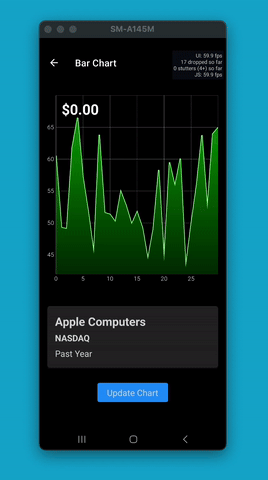

# Victory Charts Showcase

A showcase of charts available in [Victory Native XL](https://github.com/FormidableLabs/victory-native-xl) based on my [YouTube Videos](https://www.youtube.com/@DanRNLab)

## How to install

1. `cd` into the repository
2. run the `yarn` command
3. Start the bundle server with `npx expo start`

## Sample Charts

### Line Chart

A line chart complete with gestures and a linear gradient area

  

